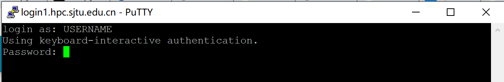
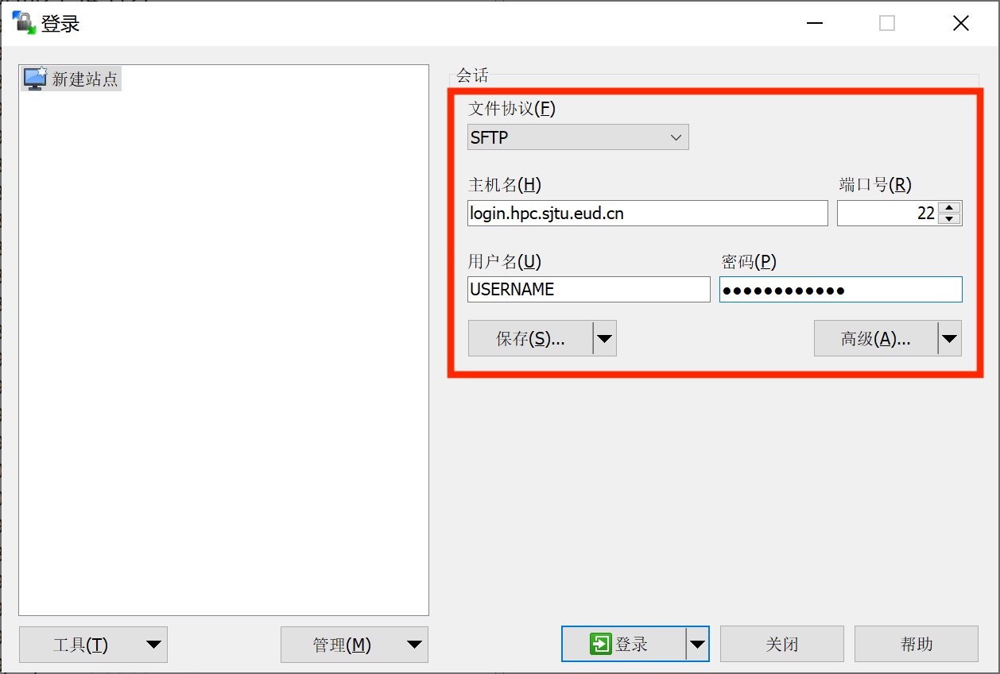
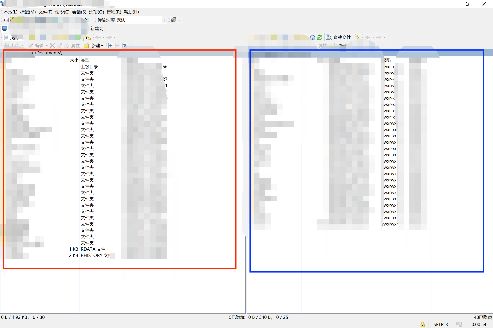
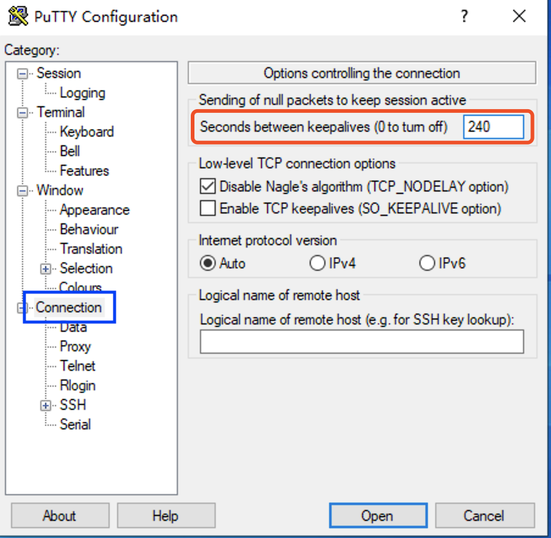
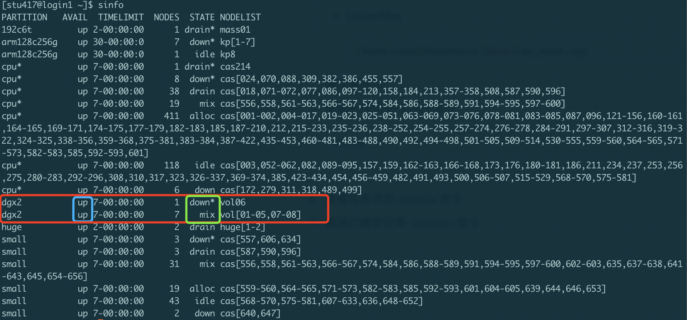

# SJTU PI2.0-超算简明教程

*Author: Kyle Chen*

## 目录
- [登录超算节点](#登陆超算节点)
- [文件传输](#文件传输)
- [Quick Start](#quick-start)
- [SLURM远程登录Jupyter Notebook](#slurm远程登录jupyter-notebook)
- [常见问题](#常见问题)


## 登陆超算节点

### 登陆地址(以下四个IP均可)

- `login.hpc.sjtu.edu.cn`
- `login1.hpc.sjtu.edu.cn`
- `login2.hpc.sjtu.edu.cn`
- `login3.hpc.sjtu.edu.cn`

### 登陆方法：

#### Unix/Mac/Linux

使用内置ssh程序，通过命令行登陆hpc服务器。以下代码示例，以用户`stu438`给出

```shell
ssh stu438@login.hpc.sjtu.edu.cn
```

根据命令行提示符`Password`输入密码（注意，密码输入过程中，终端信息不回更新），输入完成后`Enter`确认登陆。

#### Windows

使用PuTTY进行登陆


运行PuTTY，在图中红框处输入服务器信息，单击蓝框处保存（以免下次使用重复输入）



根据弹出终端窗口显示指令，输入账号密码（注意，密码输入过程中，终端信息不回更新），`Enter`登录。

## 文件传输

### Unix/Mac/Linux

使用内置`scp`或`sftp`程序上传或下载文件。下面演示使用`scp`进行文件传输：

```shell
# Upload local folder data to the remote folder ~/tmp/ on server
scp -r data/ stu438@login.hpc.sjtu.edu.cn:~/tmp/
# Download ~/data.out to current local path from remote server
scp stu438@login.hpc.sjtu.edu.cn:~/data.out ./
```

`scp`的使用方法与`cp`命令类似，其他参数设定可以参考`cp`命令。

#### Windows

使用`WinSCP`进行文件传输。



按照上图红框内所示，输入设置，其中用户名与密码为hpc服务器登陆的账号密码，随后单击`保存`，单击登陆与服务器建立连接。



左侧红框内为本地文件列表，右侧蓝框内为远程服务器文件列表，可以通过鼠标拖拽的方式进行文件上传、下载。


## Quick Start

**在HPC服务器上通过SLURM提交Python代码，进行Tensorflow相关运算。**

1. 登陆服务器

2. 通过`scp`或WinSCP上传测试代码(例：`tf_test.py`)

3. 首次登陆环境搭建

   ```shell
   # 使用module加载miniconda环境
   module load miniconda3
   # 初始化conda环境(仅第一次配置需要)
   conda init
   # 关闭conda base环境登陆自启动(不关闭会导致SLURM脚本无法正常运行)
   conda config --set auto_activate_base False
   # 创建名为tf-env的python环境，python版本为3.7
   conda create -n tf-env python=3.7
   # 激活tf-env环境
   source activate tf-env
   # 安装科学计算必要python库
   conda install numpy scipy matplotlib
   # 安装tensorflow-gpu 2(默认版本)
   pip install tensorflow-gpu
   # 若想安装tensorflow-gpu 1.15，请勿同时安装两个版本，容易出错。
   pip install tensorflow-gpu==1.15
   ```

4. 创建SLURM脚本

   1. 方法一：在远程服务器通过`vi/vim`直接编辑创建。
   2. 方法二：在本地创建纯文本文件，保存并上传。

   *脚本范例* `slurm_test.sh`

   ```bash
   #!/bin/bash
   #SBATCH -J xzq_test
   #SBATCH -p dgx2
   #SBATCH -N 1
   #SBATCH -n 1
   #SBATCH --ntasks-per-node=1
   #SBATCH --gres=gpu:1
   #SBATCH --output=%j.out
   #SBATCH --error=%j.err
   #SBATCH --time=00:30:00
   #SBATCH --mail-type=end
   #SBATCH --mail-user=your_email@sjtu.edu.cn
   
   module load cuda/10.1.243-gcc-4.8.5   # for Tensorflow >= 2.0
   module load cuda/10.0.130-gcc-4.8.5   # for Tensorflow == 1.15
   module load cudnn/7.6.5.32-10.1-linux-x64-gcc-4.8.5
   module load miniconda3
   
   # activate your python environment
   source activate tf-env
   
   # if you want to switch working directory
   # cd working_dir/
   
   python -c "import tensorflow as tf; \
              print('Num GPUs Available: ', len(tf.config.experimental.list_physical_devices('GPU')));”
   
   # run python script
   # python test_scipt.py
   ```

   

   

5. 使用`sbatch`命令递交脚本

   ```shell
   sbatch slurm_test.sh
   ```

   终端将返回如下结果：

   ```shell
   Submitted batch job 961975
   ```

   表明slurm脚本成功递交，任务id为961975。该任务号将成为查看该任务状态，并对其进行其他操作的手段。

    

6. 查看脚本运行状态`sacct`命令

   返回如下结果，通过任务id找到对应任务的状态。

   ```shell
          JobID    JobName  Partition    Account  AllocCPUS      State ExitCode
   ------------ ---------- ---------- ---------- ---------- ---------- --------
   960304             test       dgx2 acct-cfte+          1     FAILED      1:0
   960304.batch      batch            acct-cfte+          1     FAILED      1:0
   960304.exte+     extern            acct-cfte+          1  COMPLETED      0:0
   960467             test       dgx2 acct-cfte+          1  COMPLETED      0:0
   960467.batch      batch            acct-cfte+          1  COMPLETED      0:0
   960467.exte+     extern            acct-cfte+          1  COMPLETED      0:0
   961975             test       dgx2 acct-cfte+          1    RUNNING      0:0
   961975.exte+     extern            acct-cfte+          1    RUNNING      0:0
   ```

7. 查看运行结果

   `sacct`返回个任务状态中，`State`列可以能出现如下状态：

   - RUNNING: 任务仍在运行；

   - FAILED: 任务报错，前往961975.err文件，查看错误日志

     ```shell
     cat 961975.err
     ```

   - COMPLETED：任务运行结束，前往961975.out文件，查看输出结果

     ```shell
     cat 961975.out
     ```

## SLURM远程登录Jupyter Notebook

**参考资料:** [Slurm远程登录Jupyter Notebook](https://www.cnblogs.com/cookielbsc/p/12411560.html), [分享脚本远程登陆 Jupyter Notebook](https://zhuanlan.zhihu.com/p/65130699)

使用已部署SLURM的服务器或高性能计算资源（GPU和CPU）运行`jupyter notebook`时，通常会遇到以下问题。

- 通过`ssh`只能登录到slurm的登录管理节点，再通过登录节点使用slurm作业调度系统，提交slurm脚本运行作业。
- 无法再登录节点直接运行`jupyter`并通过`ssh`转发端口。

解决方案：

1. 通过`srun`命令申请交互`bash`，在其中运行`jupyter notebook`， 并通过`ssh`转发端口至本地。
2. 通过编辑slurm脚本，通过`sbatch`发送并启动`jupyter`，同时转发至本地端口。

### 交互`bash`启动`jupyter`

1. 在计算节点启动`jupyter`

   ````bash
   # srun申请队列gpu-tesla，申请资源内存10G，1块gpu，申请打开交互bash。
   srun --partition=gpu-tesla --mem=10G --gres=gpu:1 --pty bash
   # module加载anaconda及所需gpu驱动等
   module load anaconda3 cuda/10.2
   # 激活python环境 your_env
   conda activate your_env
   # 启动jupyter，指定port（可指定其他未被占用的端口），指定ip（此处以node9为例，若登录其他节点，请使用prompt中显示的节点名称）
   jupyter notebook --no-browser --port=8879 --ip=node9
   ````

2. 在本地连接`jupyter`

   ```bash
   # 8880为本地端口，node9:8879为服务器jupyter指定ip和指定端口，your_name为用户名，cluster_url为服务器ip
   ssh -N -L 8880:node9:8879 your_name@cluster_url
   ```

3. 打开浏览器，通过`localhost:8880`访问

   ```bash
   # 对于浏览器要求的token，复制启动jupyter后返回的信息中的token即可
   "http://127.0.0.1:8880/?token=260544c76ee3eeca*****************d8523886dde4656"
   ```

### Slurm脚本启动`jupiter`

1. 通过`sbatch`提交任务：

   ```bash
   sbatch jupyter-server.sh
   ```

2. 本地连接`jupyter`，并通过浏览器打开。（同交互`bash`启动`jupyter`中2-3步操作) 

   查看当前目录下log文件和error文件，通过log文件查看服务器端口，通过error文件查看token。

服务器端开启 Jupyter Notebook 服务的脚本如下：

```bash
#!/bin/bash
#SBATCH --partition you_partation
#SBATCH --nodes 1
#SBATCH --ntasks 1
#SBATCH --cpus-per-task 5
#SBATCH --mem-per-cpu 3G
#SBATCH --time 24:00:00
#SBATCH --job-name jupyter-notebook
#SBATCH --output jupyter-notebook-%J.log
#SBATCH --error jupyter-notebook-%J.err
#SBATCH --mail-user=your_email@sjtu.edu.cn

# get tunneling info
# DO NOT CHANGE
XDG_RUNTIME_DIR=""
port=$(shuf -i8000-9999 -n1)
node=$(hostname -s)
user=$(whoami)
cluster=$(hostname -f | awk -F"." '{print $2}')

### 在这里添加你的服务器地址
clusterurl="202.120.*.*"

export PATH=$PATH:~/.local/bin

# print tunneling instructions jupyter-log
echo -e "
MacOS or linux terminal command to create your ssh tunnel:
ssh -N -L ${port}:${node}:${port} ${user}@${clusterurl}
 
 Here is the MobaXterm info:

 Forwarded port:same as remote port
 Remote server: ${node}
 Remote port: ${port}
 SSH server: ${cluster}.${clusterurl}
 SSH login: $user
 SSH port: 22

 Use a Browser on your local machine to go to:
 localhost:${port} (prefix w/ https:// if using password)

 or copy the URL from below and put there localhost after http:// so it would be something like:
 http://localhost:9499/?token=86c93ba16aaead7529a5da0e5e5a46be7ad8cfea35b2d49f
 "

# 在这里添加你的module加载配置
# load modules or conda environments here
# e.g. :
# module load anaconda3 
# source activate your_env
# DON'T USE ADDRESS BELOW. 
# DO USE TOKEN BELOW.
jupyter-notebook --no-browser --port=${port} --ip=${node}
```

## 常见问题

1. 重置密码：

   首次登陆后，建议尽快使用`passwd`命令重置密码

   ```shell
   [stu438@login2 ~]$ passwd
   Changing password for user stu438.
   Current Password:
   New Password:
   Retype new password:
   passwd: all authentication tokens updated successfully.
   ```

   *密码规范*

   1. 不要使用固定的常用密码

      不要使用有意义的字符串

      密码长度至少8位

      密码中至少包含字母和数字

2. 服务器连接因超时或网络不稳定而断开

   

   在PuTTY登陆界面左侧设置选项栏中选择Connection，在右侧对应红框处，设置保持活跃时间 240。随后回到左侧Session对应服务器登陆界面，保存设置，并登陆即可。

3. Windows本地编辑后上传的脚本，运行报错如下：

   ```bash
   sbatch: error: Batch script contains. DOS line breaks (\r\n)
   sbatch: error: instead of expected UNIX linne breaks (\n).
   ```

   解决方案：

   通过vim二进制模式打开slurm脚本进行编辑。

   ```bash
   vim -b slurm_test.sh
   ```

   在vim中使用命令模式替换DOS换行符

   ```vim
   :%s/^M//g
   ```

   其中^为ctrl+v, M为ctrl+m。修改完后退出vim。

   ```vim
   :wq
   ```

4. 文件路径问题

   由于Windows和Linux的文件系统不同，路径的文件分割符不同。在Windows中，文件分割符通常为`\\`，而在Linux/Mac中，文件分割符为`/`。例如，

   - Windows

     ```shell
     D:\\Documents\\data\\raw_data.npy
     ```

   - Linux/Mac

     ```shell
     /home/user/Documents/data/raw_data.npy
     ```

   请注意区分。

5. 任务超时被中断问题。

   在SLURM任务脚本中，修改脚本开头脚本参数中

   ```shell
   #SBATCH --time=00:30:00
   ```

   - 其中`00:30:00`表示最大运行运行时间30分钟，超时即会被slurm强制终止。
   - 适当设定足够长的最大运行时间，可保证程序完整运行。
   - 注意，`dgx2`队列单任务最大允许运行时长为7天`7-00:00:00`。
   - 对于普通用户，设置过长的最大运行时间，可能导致任务长时间处于等待（PD）状态，无法正常运行。

6. 查看队列状态-`sinfo`命令

   ```shell
   sinfo
   ```

   

   如上图所示，红框内为$\pi 2.0$超算中心的GPU节点，dgx2，的状态。

   蓝框内显示队列状态：

   - `up`: 正常上线状态，可正常提交任务；
   - `down`：队列下线状态，无法接受新任务运行，已递交任务可继续运行；

   绿框内显示节点状态：

   - `idle`: 节点空闲状态，可正常提交任务；
   - `down`：节点不可用，无法提交任务；
   - `drain`：节点根据管理员设置不可使用，无法提交任务；

   根据`sinfo`返回信息，判断是否有空闲节点计算资源，合理安排任务提交。

   更多关于`sinfo`详细信息，参见[sinfo原文档](https://slurm.schedmd.com/sinfo.html)。

7. 查看任务状态-`squeue`命令

   使用`squeue`命令查看961975任务运行状态，如下：

   ```bash
   [stu417@login3 ~]$ squeue |grep 961975
               961975      dgx2  slurm_test   stu438  R      18:18      1 vol01
   ```

   其中，第5列显示任务当前状态，`R`为running运行中，`PD`为pending排队中。最后一列为当前任务所在计算节点的名称。

   更多关于`squeue`详细信息，参见[squeue原文档](https://slurm.schedmd.com/squeue.html)。

8. 取消已提交任务-`scancel`命令

   取消 961975 任务：

   ```bash
   scancel 961975
   ```

   取消`stu438`用户的所有任务：

   ```bash
   scancel -A stu438
   ```

   更多关于`scancel`详细信息，参见[scancel原文档](https://slurm.schedmd.com/scancel.html)。

9. 使用`srun`命令登陆计算节点，进行交互式任务递交与执行

   ```bash
   srun --partition=dgx2 --nodelist=vol07 --mem=6000 --gres=gpu:1 -n1 -N1 --pty --preserve-env $SHELL
   ```

   上述命令，通过`srun`登陆`dgx2`队列中的 `vol07`节点，申请1个节点(-N1)，6000MB内存(--mem=6000)、1块GPU(--gres=gpu:1)。

   更多关于`srun`详细信息，参见[srun原文档](https://slurm.schedmd.com/srun.html)。

